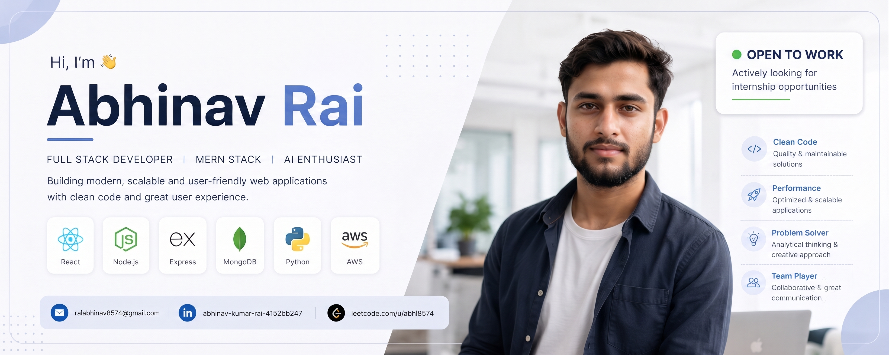
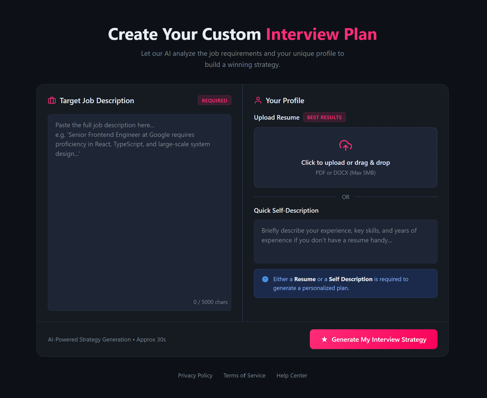
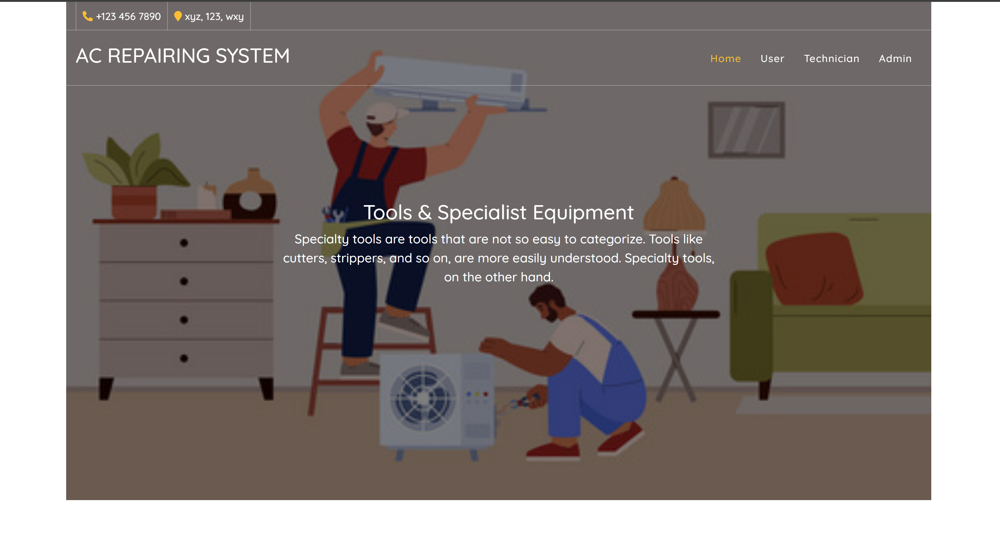

<div align="center">



# Hi 👋, I'm Abhinav Rai

### Full Stack MERN Developer • AI Enthusiast • Backend Developer

<p>

</p>

<p>

<a href="mailto:raiabhinav8574@gmail.com">

</a>

<a href="https://www.linkedin.com/in/abhinav-kumar-rai-4152bb247">

</a>

<a href="https://leetcode.com/u/abhi8574/">

</a>

<a href="https://drive.google.com/file/d/1vaPEmjaCMGKxey-eyD8uJqSetDPH1h8P/view">

</a>

</p>

</div>

---
## 👨‍💻 About Me

```yaml
Name: Abhinav Rai

Role: Full Stack MERN Developer

Education: B.Tech (Information Technology)

Location: India

Currently Learning:
  - System Design
  - Docker
  - AWS
  - AI Integration

Looking For:
  - Software Development Internship

Interests:
  - Backend Development
  - AI Applications
  - Cloud
  - Open Source
```
## 🚀 Tech Stack

### Languages

<p>


</p>

### Frontend

<p>


</p>

### Backend

<p>


</p>

### Database

<p>


</p>

### Tools

<p>


</p>

---
## 🚀 Current Focus

- 🔥 Building Full Stack MERN Projects
- 🤖 Developing AI Applications
- 📚 Solving Data Structures & Algorithms
- ☁️ Learning AWS & Cloud Deployment
- 🐳 Exploring Docker & DevOps

<h2 align="center">🚀 Featured Projects</h2>

<table>

<tr>

<td width="50%">

<h3 align="center">🤖 AI Interview Preparation Platform</h3>

<div align="center">

<a href="https://github.com/imabhinavraii/AI-Interview-Preparation-Platform">



</a>

</div>

### ⭐ Features

- AI Mock Interviews
- Resume Analysis
- Skill Assessment
- Gemini AI Integration
- Authentication
- Dashboard
- Responsive UI

### 🛠 Tech Stack

React • Node.js • Express • MongoDB • Gemini API

<p>

<a href="https://github.com/imabhinavraii/AI-Interview-Preparation-Platform">


</a>

</p>

</td>

<td width="50%">

<h3 align="center">🔧 AC Repairing Management System</h3>

<div align="center">

<a href="https://github.com/imabhinavraii/ACRepairingManagementSystem">



</a>

</div>

### ⭐ Features

- Customer Management
- Service Booking
- Admin Panel
- Invoice
- Service History
- Complaint Tracking

### 🛠 Tech Stack

Python • Django • HTML • CSS • JavaScript

<p>

<a href="https://github.com/imabhinavraii/ACRepairingManagementSystem">


</a>

</p>

</td>

</tr>

</table>

---

## 🌍 Travel & Tourism Website

> Responsive tourism platform built using Django.

**Features**

- Hotel Booking
- Destination Listing
- Authentication
- Search
- Admin Dashboard

**Tech Stack**

Python • Django • SQLite

<a href="YOUR_REPOSITORY">


</a>

---

<h2 align="center">📊 GitHub Dashboard</h2>

<div align="center">


</div>

<div align="center">


</div>

---

## 📈 Contribution Graph

<p align="center">


</p>

---

## 🏆 GitHub Achievements

<p align="center">


</p>

---
## 🎯 2026 Goals

- ✅ Crack Product-Based Company
- ✅ Software Development Internship
- ✅ 500+ DSA Problems
- ✅ Build AI SaaS Projects
- ✅ Master MERN Stack
- ✅ Learn AWS
- ✅ Learn Docker
- ✅ Learn Kubernetes
- ✅ Contribute to Open Source


## 🐍 Contribution Snake

<p align="center">


</p>

---

## 👀 Profile Views

<p align="center">


</p>

---

## 📫 Connect With Me

<p align="center">

<a href="mailto:raiabhinav8574@gmail.com">


</a>

<a href="https://www.linkedin.com/in/abhinav-kumar-rai-4152bb247/">


</a>

<a href="https://github.com/imabhinavraii">


</a>

</p>

---

## 💬 Developer Quote

> "First, solve the problem. Then, write the code." – John Johnson


<div align="center">

### ⭐ Thanks for visiting my profile!

If you like my work, consider giving a ⭐ to my repositories.


</div>
